# DirectX 11 Radio Buggy 2 game

Based on Dark Island engine. Added car. 

WSAD to drive.

Mouse Left Click - Shoot Object

Keyboard Numbers 1 - 5 Select Object

Shift - Rapid Fire

R - Respot when upside down

[Youtube Video](https://youtu.be/MRI0ujjIvcI)

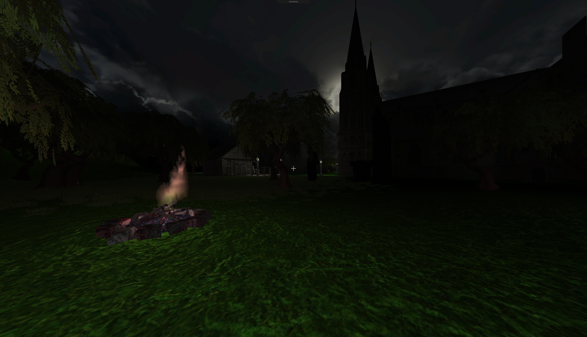

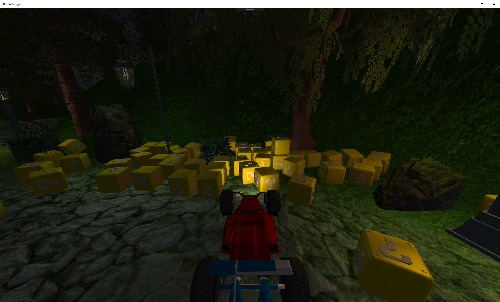

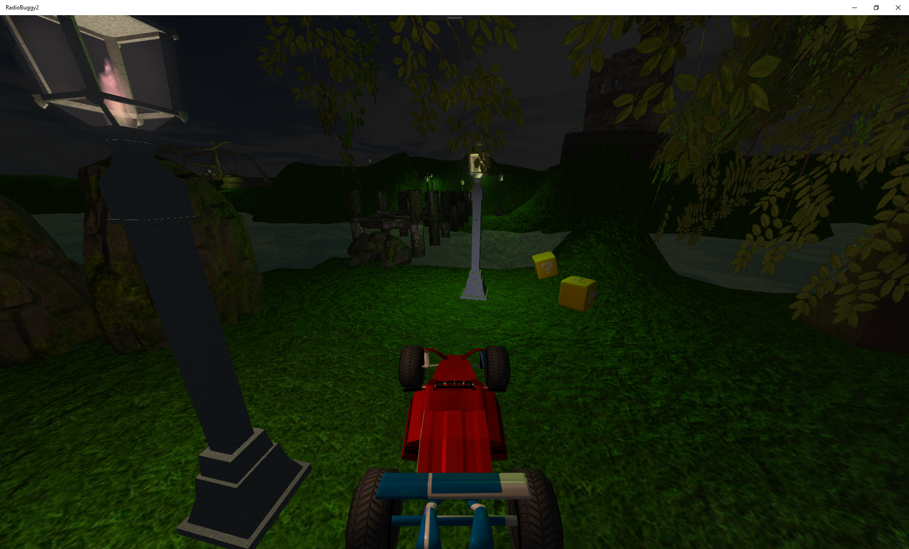

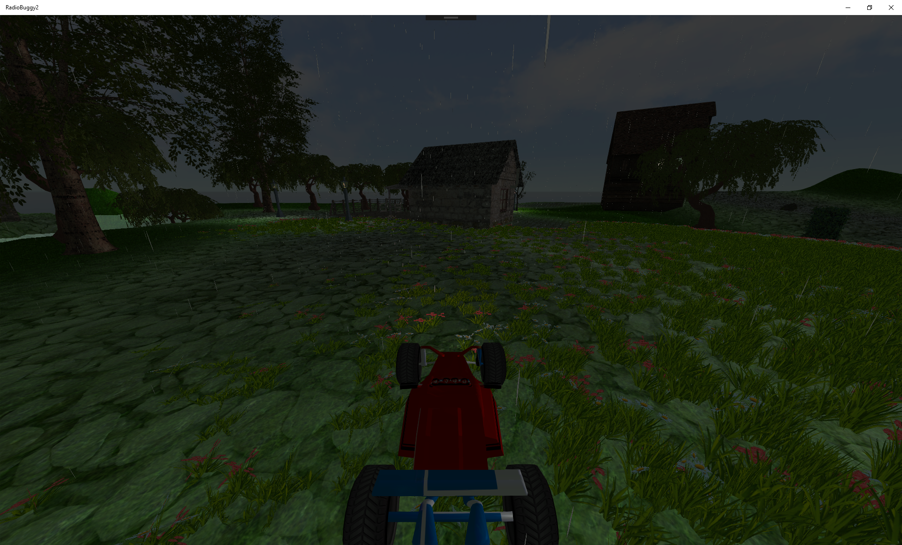

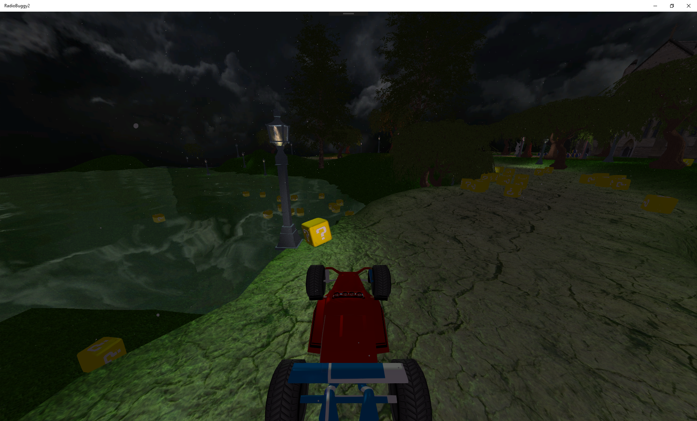

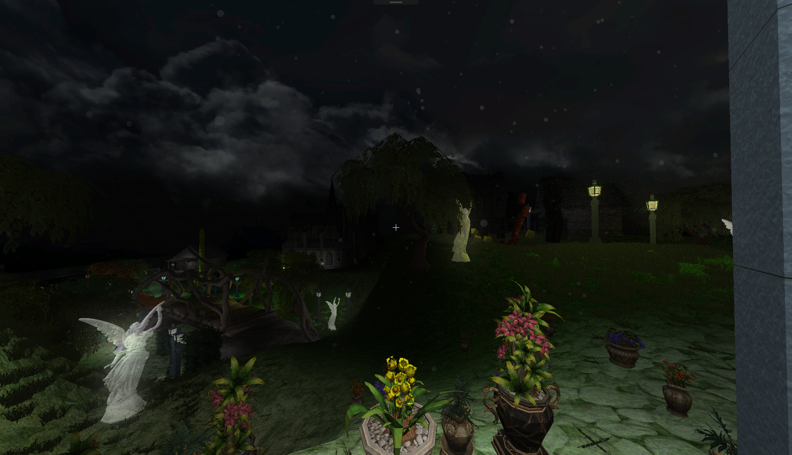

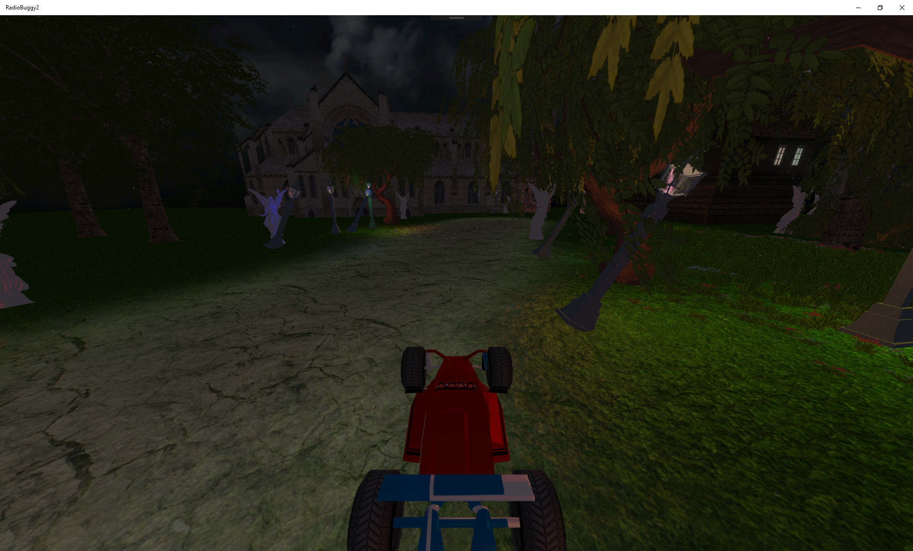

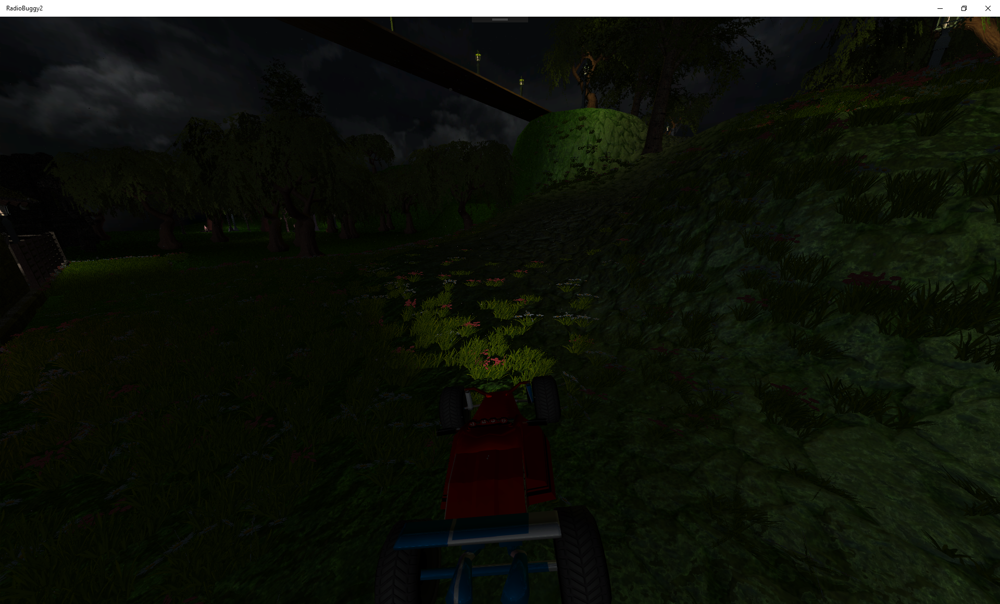

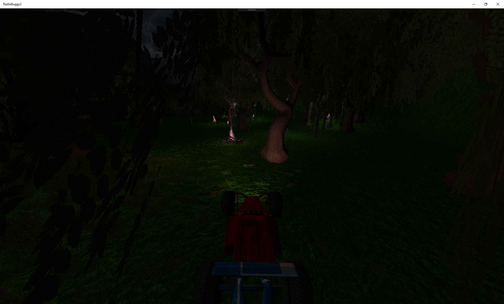

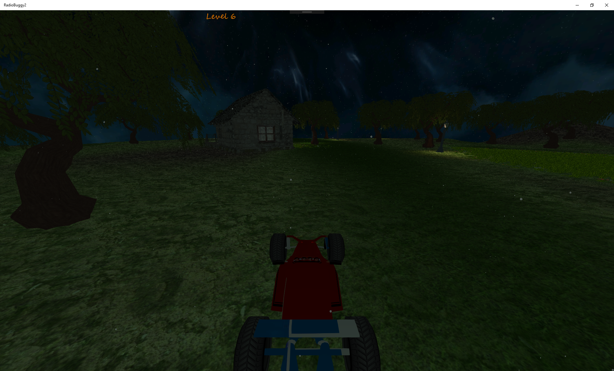

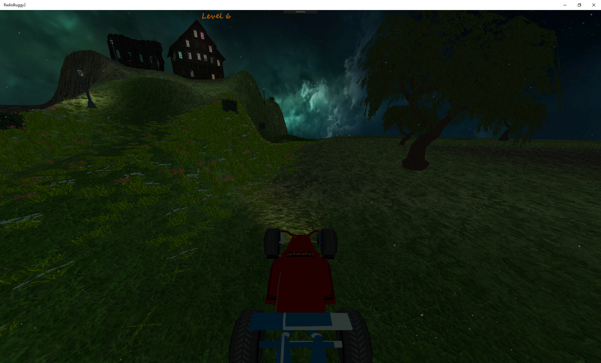
